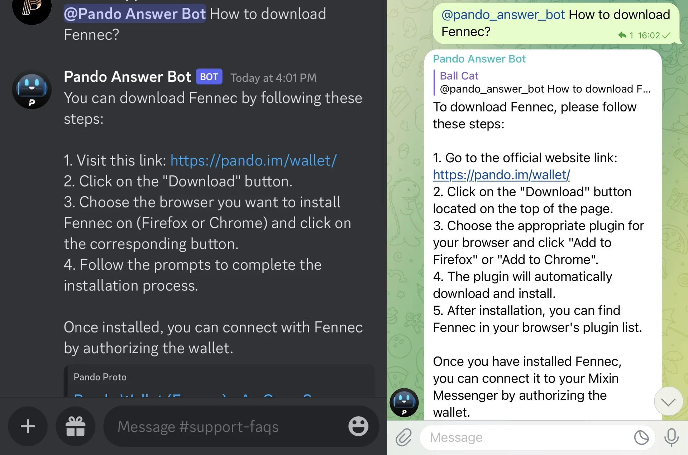

# PAL9000

[PAL9000](https://github.com/pandodao/PAL9000) is an opensource chatbot service based on Botastic. 

It supports multiple adapters as frontend, including **Telegram**, **Discord**, **Mixin Messenger** and **WeChat Official Account**.

Pando use it as the anwser bot for our community. You can find it at [t.me/pando_bot](https://t.me/pando_telegram), [Pando@Discord](https://discord.com/invite/ek45g3Cymd) or Mixin Group (7000104110).



## 🏁 Getting Started

Register an App and a bot at Pando Developer Console: https://developers.pando.im/console/botastic and get the App ID, App Secret and the Bot ID.

## 🍲 Feed Data

Install [botastic-cli](https://github.com/pandodao/botastic-cli) and run the following command to feed data to the bot:

```bash
export BOTASTIC_APP_ID=YOUR_APP_ID
export BOTASTIC_SECRET=YOUR_APP_SECRET
botastic-cli scan --dir ./docs --type md --mode paragraph
```

In which `./docs` is the folder containing the markdown files, `md` is the type of the files, and `paragraph` is the mode of the scan.

`botastic-cli` will scan the `./docs` recursively and generate a `indexes.json` file. Then you can upload the indexes to botastic using the following command:

```bash
export BOTASTIC_APP_ID=YOUR_APP_ID
export BOTASTIC_SECRET=YOUR_APP_SECRET
botastic-cli index --act create --file indexes.json
```

<!-- Install PAL9000 -->
## 📦 Install PAL9000

Run the following command to install PAL9000:

```bash
go install github.com/pandodao/PAL9000@latest
```

## 📝 Generate Config File

Run the following command to generate an example config file:

```bash
PAL9000 config -e > config.yaml
```

Please fill the `app_id`, `app_secret` and `bot_id` in the config file, and create an `adapters` section for a Discord adapter as example:

```yaml
general:
  bot:
    bot_id: YOUR_BOT_ID
    lang: en
  botastic:
    app_id: "YOUR_APP_ID"
    host: https://botastic-api.pando.im
    debug: false
adaptors:
  # enabled:
  #   - your_adapter_name
  # items:
  #   your_adapter_name:
  #     ... 
```

In which, `YOUR_BOT_ID` and `YOUR_APP_ID` is the Bot ID and App ID you got from Pando Developer Console.

## 🏃 Run PAL9000

Use the following command to run PAL9000:

```bash
PAL9000 run --config config.yaml
```

PAL9000 will exit immediately because there is no adapter enabled by default.

## 📡 Add Adapters

PAL9000 supports different type of adapters. To enable them, you should add adapter definitions to the `adaptors` section in the config file.

### 📩 Add Telegram Adapter

Search `@BotFather` on Telegram, and tpye `/newbot` to create a new bot. @BotFather will ask you to set a name and a username for the bot. After that, you will get a token for the bot. Copy the token for the next step.

Type `/mybots` and select the bot you just created, then click `Bot settings` and `Group privacy`, disable `Group privacy` so the bot can receive messages from groups.

Edit the config file and add the code under `adaptors` section:

```yaml
# ...
adaptors:
  enabled:
    - example_telegram_adapter # enable the telegram adapter
  example_telegram_adapter:
    driver: telegram        # use the telegram driver
    debug: false
    telegram:
      token: "YOUR_TELEGRAM_BOT_TOKEN" 
      whitelist:
        - "the chat ID"  # the chat ID of the group you want to enable the bot in
```

Please note that the `whitelist` is a list of chat IDs. PAL9000 only responds to the messages in the chats in the whitelist.

To get the chat ID, you can search a bot named `@RawDataBot` and add it to the group, then it will send the raw data of the message to the group. You can find the chat ID in the raw data, which is a number like `-123456789`.

Save the config file and restart PAL9000, add your bot to the group and send a message to mention the bot, it should reply to you.

### 🎮 Add Discord Adapter

Follow the steps below to create a Discord bot:

1. Visit [https://discord.com/developers/applications](https://discord.com/developers/applications) to create a new application.
2. Click the `Bot` tab and create a new bot, and then copy the Bot Token.
3. Check the switch at "MESSAGE CONTENT INTENT - Required for your bot to receive message content in most messages." so the bot can receive message content.
4. Switch to the `OAuth2` tab, and check the `bot` scope, and check the following bot permissions:
  - Send Messages
  - Send Messages in Threads
  - Embed Links
  - Read Message History
5. Then copy the URL and visit it to add the bot to your server.

Edit the config file and add the code under `adaptors` section:

```yaml
# ...
adaptors:
  enabled:
    - example_telegram_adapter
    - example_discord_adapter # enable the discord adapter
  example_discord_adapter:
    driver: discord        # use the discord driver
    debug: false
    discord:
      token: "YOUR_DISCORD_BOT_TOKEN" 
      whitelist:
        - "the guild ID"  # the guild ID of the server you want to enable the bot in
```

Please note that the `whitelist` is a list of Discord guild ID. PAL9000 only responds to the messages in the chats in the whitelist.

the Discord Guild ID indicate which server you want to enable the bot in. Please go to your server on a webpage, in the url is both your guild id and channel id: `https://discord.com/channels/<Guild_ID>/<ChannelID>`

Save the config file and restart PAL9000, add your bot to the group and send a message to mention the bot, it should reply to you.

### 🍹 Add Mixin Messenger Adapter

Follow the steps below to create a Mixin Application:

1. Visit [https://developers.mixin.one/dashboard](https://developers.mixin.one/dashboard) to create a new application.
2. Click "Ed25519 session" to generate a new keystore and save it as `keystore.json`.
3. Run the following command to get the base64 encoded keystore and copy it:
  ```bash
  cat keystore.json | base64 -w 0
  ```

Edit the config file and add the code under `adaptors` section:

```yaml
# ...
adaptors:
  enabled:
    - example_telegram_adapter
    - example_discord_adapter 
    - example_mixin_adapter # enable the mixin adapter
  example_mixin_adapter:
    driver: mixin        # use the mixin driver
    debug: false
    mixin:
      keystore: "YOUR_BASE64_ENCODED_KEYSTORE" # paste the base64 encoded keystore here.
      whitelist:
        - "supergroup ID"  # the supergroup ID of the supergroup you want to enable the bot in
        - "conversation ID" # the conversation ID of the normal group you want to enable the bot in
```

Please note that the `whitelist` is a list of conversation ID or supergroup ID. 

Save the config file and restart PAL9000, add your bot to the group and send a message to mention the bot, it should reply to you.

### 📝 Note for Mixin Messenger Adapter

**Get the Conversation ID**

To get the conversation ID, you can copy an invite link of the group, it should be like:

```
https://mixin.one/codes/12345678-xxxx-xxxx-xxxx-xxxxxxxxxxxx
```

Change the domain to `api.mixin.one`:

```
https://api.mixin.one/codes/12345678-xxxx-xxxx-xxxx-xxxxxxxxxxxx
```

And visit the url in web browser, you will get a json response, the `conversation_id` is the conversation ID.

**Pass the OAuth of the Supergroup**

All supergroups in Mixin Messenger use OAuth to authenticate users, so you need to pass the OAuth of the supergroup to the bot.

To get the OAuth, you can use the example code of [mixin-sdk-go](https://github.com/fox-one/mixin-sdk-go):

Clone the repo and run the following command:

```bash
cd mixin-sdk-go/_examples/authorization
go run main.go -client_id=CLIENT_ID_OF_SUPERGROUP -scope "PROFILE:READ MESSAGES:REPRESENT" -config BOT_KEYSTORE_FILE -callback
```

Then you will get an url like:

```
https://supergroup.abc.com/auth/mixin/callback?code=1a82b78cc552f6af789058209a6279af7fa4e6507823dfb22935a0628b1dxxxx
```

Visit the url in web browser, you will pass the OAuth of the supergroup.

