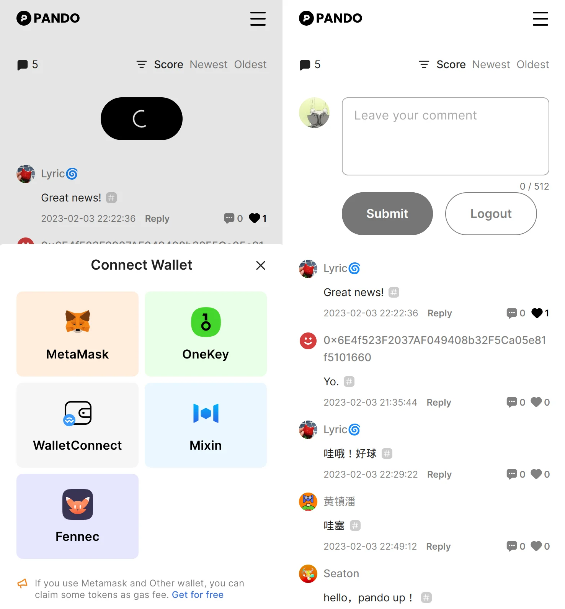

# Talkee

**Talkee** is a powerful comment hosting solution for web sites and web3 applications. With its seamless integration, it can be easily embedded into any web-based platform, allowing users to connect their wallets and leave comments.

The comments' content can be securely stored on the blockchain, with [Arweave](https://www.arweave.org/) as the default decentralized storage network.

Hosts have the ability to reward active commenters with cryptocurrencies based on customizable rules and criteria.



## Demo

Please visit [this page](https://talkee.pando.im/demo.html) to see the demo.

## Who's using Talkee

- [Pando](https://pando.im) - The official website of Pando.
- [Coinpost](https://coinpost.jp) - A famous Japanese cryptocurrency and blockchain media. Talkee is used to collect comments from the readers and distribute Bitcoin to the top commenters.

## Register your site

To apply for a `site_id`, please visit [this page](https://talkee.pando.im/) to register your site.

The following details are required:

- Your site name
- Your site origin (e.g. https://pando.im)

::: tip Notes
- You need to sign in with Mixin Messenger to register your site.
- Each account can only register 3 sites.
- An amount of tokens/coins may be required to cover the cost of the reward feature.
- Currently, we only support arweave as the storage network.
- Ensure that the tokens/coins you want to distribute are supported by [Mixin Network](https://mixin.one/snapshots).
:::

### Pricing

Talkee is free.

## Installation (Vue3)

Talkee is a Vue3 component, making it easy to integrate into your Vue3 project. 

For installation instructions, visit [this page](https://github.com/fox-one/uikit-next/tree/main/packages/talkee).

## Installation (Universal)

If you are using any other CMS, or static site generators, such as Gatsby, Jekyll, Hugo, etc, you can easily integrate Talkee into your site by putting the following script to the end of your `<body>` tag. Don't forget to replace the `YOUR_SITE_ID_HERE` with your site id.

```html
<body>
  <!-- ... -->
  <script src="https://cdn.jsdelivr.net/npm/@foxone/talkee-install-js@latest/dist/ti.min.js"></script>
  <script>window.tijs({ siteId: YOUR_SITE_ID_HERE, authMethods: ["mixin", "fennec"] });</script>
</body>
```

## Installation (Wordpress)

If you are using Wordpress, We recommend using the [WPCode](https://wordpress.org/plugins/insert-headers-and-footers/) plugin to integrate Talkee.

Install WPCode, enable it. Then, go to the plugin settings page "Code Snippets -> Header & Footers", and add the following code to the `Header` section, which will fix some style glitches:

```html
<style>
	#comments {
		display: none;
	}
	.talkee {
		margin-top: 40px;
		padding: 0 !important;
	}
	.talkee textarea, .talkee input {
	  border: none;
	}
	.talkee .v-btn:hover {
	    background-color: inherit;
	}
	.talkee .info .v-btn {
		height: 20px;
		font-size: inherit;
		line-height: inherit;
		font-family: inherit;
		font-size-adjust: inherit;
		background: transparent;
		padding: 0;
		outline: none;
	}
	.talkee .info .v-btn__overlay {
		background: transparent;
	}
</style>
```

Add the following code to the `body` section. Don't forget to replace the `YOUR_SITE_ID_HERE` with your site id.

```html
<script src="https://cdn.jsdelivr.net/npm/@foxone/talkee-install-js@0.1.1/dist/ti.min.js"></script>
<script>window.tijs({ siteId: YOUR_SITE_ID_HERE, authMethods: ["mixin", "fennec"] });</script>
</script>
```

Click the `Save` button to save the changes.

## Installation (UMD)

If you wanna integrate Talkee into your site with more flexibility, please follow the steps below.

### Put the scripts and css in your HTML

```html
<head>
  <meta charset="UTF-8" />
  <meta http-equiv="X-UA-Compatible" content="IE=edge" />
  <meta name="viewport" content="width=device-width, initial-scale=1.0" />
  <!-- insert styles -->
  <link
    href="https://cdn.jsdelivr.net/npm/@foxone/talkee@3.0.0/dist/style.css"
    rel="stylesheet"
  />
  <title>Talkee UMD Demo</title>
</head>
<body>
  <!-- insert scripts -->
  <script src="https://cdn.jsdelivr.net/npm/vue@3.2.45/dist/vue.global.prod.js"></script>
  <script src="https://cdn.jsdelivr.net/npm/@foxone/talkee@3.0.0/dist/index.umd.js"></script>
  <!-- the container -->
  <div id="comments"></div>
</body>
```

### Use Talkee in your js code

```js
const talkeeOpts = {
  apiBase: "https://talkee-api.pando.im/api",
  slug: window.location.pathname,
  // show the link to the arweave transaction page if possible
  showLink: true,
  // the site id, required
  siteId: "YOUR_SITE_ID_HERE",
  // the container selector to render the talkee
  container: "#comments",
  // default locale is en
  locale: "en",
  // add supported auth methods
  auth: {
    authMethods: ["metamask", "walletconnect", "mixin", "fennec"],
  }
};

function installTalkee() {
  const _checkTalkee = () => {
    return window.Talkee && window.Talkee.install && window.Vue;
  }
  setTimeout(() => {
    if (_checkTalkee()) {
	    if (document.getElementById("comments")) {
        window.Talkee.show(talkeeOpts);
	    }
    } else {
      // try again
      installTalkee();
    }
  }, 1000);
}
installTalkee();
```

for more options, please visit [this page](https://github.com/fox-one/uikit-next/tree/main/packages/talkee) to see the installation guide.


## Use Talkee APIs with your own UI

Talkee provides [comphrensive APIs](../references/talkee/api.md) for developers to customize the UI and the behavior of the comment system.

We provide a <a href="/demo/talkee" target="_blank">demo</a> to show how to use the APIs to build a custom comment system.

## Enable MetaMask and WalletConnect support

To enable MetaMask and WalletConnect support, add the following code to your HTML:

```html
<script src="https://cdn.jsdelivr.net/npm/@foxone/mvm@0.1.29/dist/mvm.min.js"></script>
```

And follow [the instructions](../references/auth-client.html#eip-4361-sign-in-with-ethereum) to implement the EIP-4361 sign in flow.
