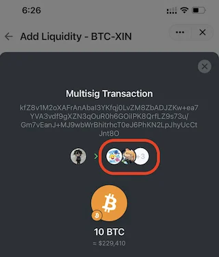
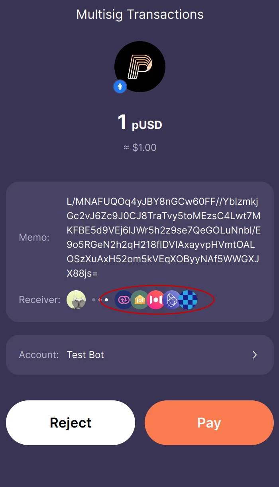
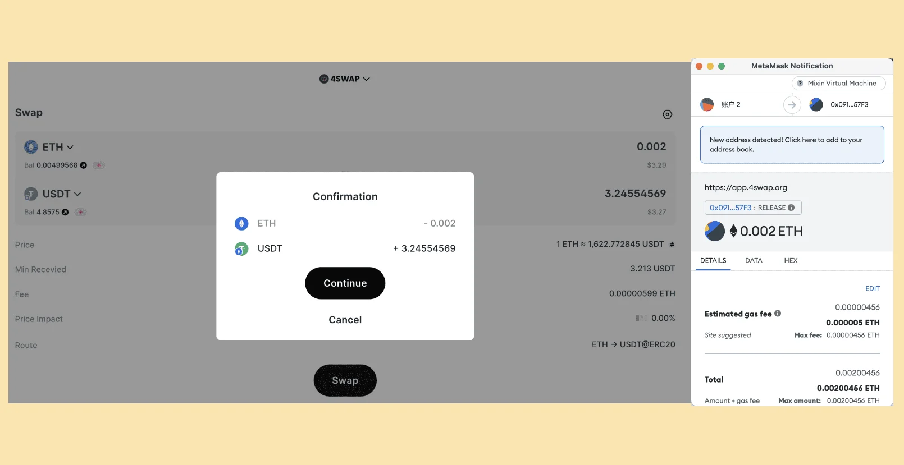

# Understand MTG

## What's MTG?

MTG is the short name of "[Mixin Trusted Group](https://developers.mixin.one/docs/mainnet/mtg/overview)", which is a kind of multisig technology application development paradigm.

Each MTG implementation could be considered as a side chain of the Mixin Network, composed of multiple independent nodes, and the consensus is reached through the multi-signature technology of the Mixin main network.

Pando uses MTG to manage assets in a decentralized way. The MTG nodes are called "MTG Nodes". At present, there are 3 protocols are built with MTG, they are [4swap/Pando Lake](https://pando.im/4swap), [Pando Leaf](https://pando.im/leaf), [Pando Rings](https://pando.im/rings). All of them are managed and controlled by a group of nodes.

In the previous section, we have learned that to call 4swap's `/info` API to read the MTG information:

<!--@include: ../parts/responses/4swap-info.md-->

the `members` and `threshold` combination indicates a unique multisig address on Mixin Network, which is the MTG of 4swap.

## How Pando's MTG works?

Each Pando's MTG is basically a multisig address which own by the collection of MTG Nodes. The MTG Nodes are watching the incoming transactions of the multisig address. 

When a transaction is sent to the multisig address, the MTG Nodes will handle the transaction individually. According to the protocols requirements,
The MTG Nodes will verify the transaction, read the data which curried by the transaction, process the data, and then sign transactions to reach the consensus.

When a response transaction is required, the MTG Nodes will sign the new transactions and send it to the Mixin Network. The Mixin Network will broadcast the transaction to the whole network.

## How wallets interact with Pando's MTG?

You need supported wallets to send transactions to the MTG. The supported wallets could be found in [Supported Wallets](/guide/wallets).

If you run the wallets and try to send the multisig transactions, you may see similar screen:

<strong>Mixin Messenger</strong>

<strong>Fennec</strong>

<strong>Metamask and WalletConnect compatible wallets</strong>

::: warning
Please note that for the limitation of Metamask and WalletConnect compatible wallets, there is no obvious way to identify the MTG transactions. You may need to check the opponent's address and transaction memo to identify the MTG transactions.
::: 

